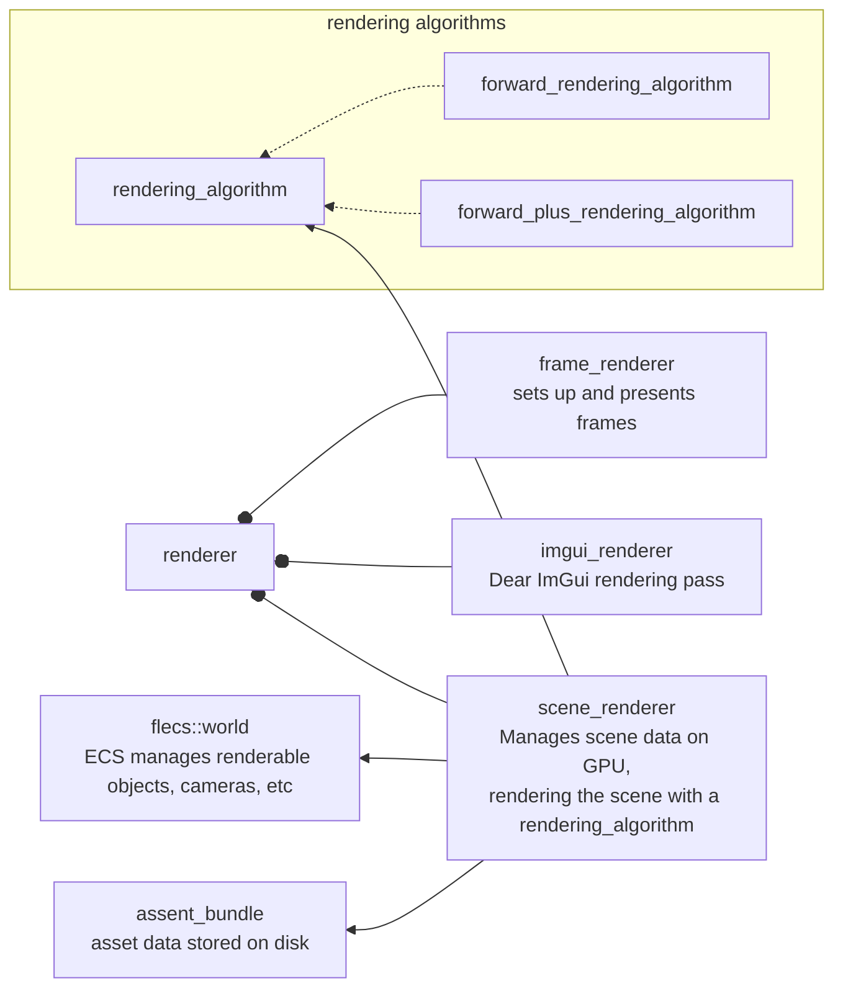

# engine11
A(nother) modern Vulkan graphics engine, building on lessons learned from [eggv](https://github.com/andrew-pa/eggv).

```mermaid
flowchart RL
  renderer
  frame_renderer[frame_renderer\nsets up and presents frames]
  imgui_renderer[imgui_renderer\nDear ImGui rendering pass]
  scene_renderer[scene_renderer\nManages scene data on GPU,\nrendering the scene with a rendering_algorithm]
  
  frame_renderer --o renderer
  imgui_renderer --o renderer
  scene_renderer --o renderer
  
  scene_renderer --> world[flecs::world\nECS manages renderable objects, cameras, etc]
  scene_renderer --> asset_bundle[assent_bundle\nasset data stored on disk]
  scene_renderer --> rendering_algorithm
  subgraph rendering algorithms
    direction BT
    rendering_algorithm
    forward_rendering_algorithm -.-> rendering_algorithm
    forward_plus_rendering_algorithm -.-> rendering_algorithm
  end
```
